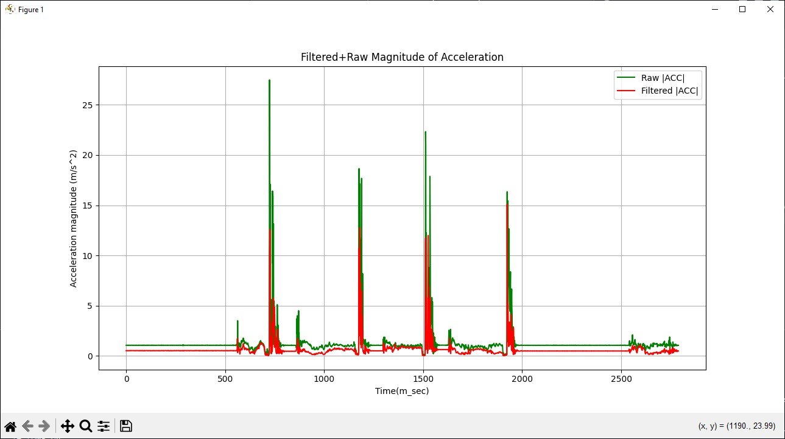

# ear-tag
Ear tag with LORA

## Introduction 
This proejct implements a catle ear tag using LORA technology. The purpose of the tag is to monitor location and activity of the 
cattle. It is tailored to open ranch setups where the cattle have a huge chunk of land to graze.

This ear tag also monitors the activity level of the cattle and uses a custom algrithm to detect shcok and abnormal vibrations 
to tell whether the animal fell, is still lying down etc.

## How it works
The device reads accelerations from an accelerometer sensor and does data processing to translate them into useful data like shock and activity levels.
Using a GPS, we can monitor the real-time location of the animal. 

This data is transmitted to a base station via a LORA gateway and visualized on the farmer's device, either 
phone and/or desktop setup.

## Measuring acceleration and activity monitoring
MPU6050 measures acceleration using its on-chip accelerometer with four programmable full scale ranges of ±2g, ±4g, ±8g and ±16g that can be set by the user.The X, Y and Z are relative to how the chip sits on the module as shown to the right and will ultimately be dependent on the orientation of the module 
on the device.

### Measuring rotation 
MPU6050 measures rotation using its on-chip gyroscope with four programmable full scale ranges of ±250°/s, ±500°/s, ±1000°/s and ±2000°/s that can be set by the user. The axis of rotation are relative the the X,Y and Z shown to the right.

### Using the I2C Interface
The module uses I2C interface for communications with MCU.It supports two different I2C addresses;0x68 and 0x69.That allows two devices to be used on the same bus or in case there is an address conflict with another device on the bus. The AD0 pin determines the I2C address to use.This pin has built in 4.7k pull-down resistor on module.if the pin is left unconnected,the line will be pulled low and the default I2C address will be 0X68.To select 0x69, connect the ADO pin to 3.3V. The SCL and SDA pins connect to A5 and A4 pins in analog input pins on the arduino board. The Auxiliary I2C address with pins labeled EDA and ECL are an I2C bus controlled by the MPU-9250 so that it can communicate directly with other sensors so that it can get additional information for its internal computations.

### Pitch and roll calculation 
Acceleration is read from all axes(x, y, z). The read values are then used to calculate the pitch and roll angles as shown below.

#### Pitch calculation
```c
pitch = 180 * atan2(accelX, sqrt(accelY*accelY + accelZ*accelZ))/PI 
```

#### Roll calculation 
```c
roll = 180 * atan2(accelY,sqrt(accelX*accelX + accelZ*accelZ))/PI
```

### Filtering and correcting MPU6050 data for accuracy 
After obtaining MPU6050 accelerometer and gyroscope readings, addressing sensor drift, noise, and measurement errors is essential for accurate motion tracking and orientation estimation. [1]

Animal exhibit distinct diurnal patterns depending on the time of day[2]. This means that in the morning and evening they show high activity but during nightime they are ruminating and therefore low activiy.  To detect the shocks, a High pass filter(HPF) is used to discard all data/noise below a given cutoff frequency. 

#### Complementary filter
This ear tag uses a simple complemetary filter to do the data cleanup especially when calulating the pitch and roll angles. 
The formula is shown below: 

```c
angle = alpha * (accelerometer_value + gyroscope_value * dt) + (1 - alpha)* accelerometer_value

```

The graph shows the results obtained from applying this complementary filter:


The red line shows the filtered pitch angle while the blue line shows the raw pitch angle.

#### Moving average filter
The moving average filter is used to smooth out acceleration values to remove high frequency noise. It averages the last N values and returns a cleaner value. This filter is used when we do not have big memory constraints and at the same time we need to implement basic filtering. 

```
/* pseudo code */

create a buffer  
read sensor  
store the previous N values 
calculate the average of the values 
return the average 
```

The acceleration values are prone to high frequency noise therefore the average filter was applied to them. The image below shows the result of filtering the x acceration:


The blue line shows the raw unfiltered value. Red line shows the filterd value. As it can be seen, the moving average filter works as expected, removing high frequency noise from the acceleration value.

## Shock detection 
In case the animal falls, we can use the MPU6050 to detect the shock and apply corrective measures. The accelerometer used is configured to measure up to (+/-)16g range.

### Resultant acceleration calculation 
To be able to register sudden animal activity, we have to keep track of the resultant acceleration, also called the magnitude of acceleration. The graph below shows the valeus of the raw magnitude of acceleration(using raw unfiltered values):


The sharp spikes show the acceleration when the device is dropped from about 40 cm high. It can clearly be seen that the magnitude of acceleration is high when this occurs.  

This next figure shows the resultant acceleration using raw and filtered acceleration values, combined into a single plot.



The red line shows the cleaner values obtained from the accelerometer.

By monitoring the value of this acceleration, we can be able to set a threshold that we then check to determine if there is a sudden upsurge of activity.

## Real Time animal tracking with GPS 
To track the animal in real time we emply a NEO6M GPS module that read the GPS location data. The data read from GPS is:  
- latitude
- longitude
- day
- month
- year
- minute 
- second 

This data is then packaged into a packet to make it easier for transmission. 
The GPS is read at a frequency defined by the DATA_UPDATE frequency value.

## LORA packet structure
| Field Name              | Data Type    | Description                     |
|-------------------------|--------------|---------------------------------|
| **tag_id**              | `uint32_t`   | Unique identifier for the tag   |
| **mode**                | `uint8_t`    | `0` = Operational, `1` = Simulation |
| **day**                 | `uint8_t`    | Day (1-31)                      |
| **month**               | `uint8_t`    | Month (1-12)                    |
| **year**                | `uint16_t`   | Year (e.g., 2025)               |
| **hour**                | `uint8_t`    | Hour (0-23)                     |
| **minute**              | `uint8_t`    | Minute (0-59)                   |
| **second**              | `uint8_t`    | Second (0-59)                   |
| **latitude**            | `float`      | GPS latitude in degrees         |
| **longitude**           | `float`      | GPS longitude in degrees        |
| **geo_fence_proximity** | `uint8_t`    | Proximity to geofence (0-100%)  |
| **acceleration_x**      | `float`      | X-axis acceleration (m/s²)     |
| **acceleration_y**      | `float`      | Y-axis acceleration (m/s²)     |
| **acceleration_z**      | `float`      | Z-axis acceleration (m/s²)     |
| **acceleration_magnitude** | `float`  | √(x² + y² + z²) (m/s²)        |


## Network and WiFi Provisioning
The device is configured to search for available networks and connect to them automatically.   To do this, we implement a WIFI provisioning scheme that allows you to connect to the network you desire. 

Follow the steps below to connect:

- once the device is powered on, it will create a WIFI netwoek called "EAR-TAG-WIFI", whose password is "password".
- Using your phone or PC, connect to this network.
- Once connected, open your browser and type the following IP address"
```
192.168.4.1
```

- A page with buttons will open up.
- Click on "Configure WIFI". A list of available networks will be shown. (Also here you can type teh SSID or password of the network that you will create, assuming you are using only one device)
- click on save
- The device will reboot itself and save the network accordingly.

## connecting to server
This section defiens the steps to connect tot the server. The server is built using with NodeJS and runs a MongoDB database. 

1. Install NodeJS, open the ```web app``` folder in terminal 
2. Run the following command.
```c
nodemon server.js
```
3. To get the IP address of the server, run the following command in terminal of your host machine 
```
ipconfig
```

Now to make the ear-tag-device connect to the server, make sure the PC amd the ear tag are on the same network using the WIFI 
connection procedures listed above. 

### Update the server URL in code
Since this is not a production environment and we have dynamic IP addresses, we need to update our server IP address in the Ear-tag firmware. Locate the server line below in the firmware and change to:

```c
const char* server_url = "http://YOUR_IP_ADDRESS:3000/api/location";

```
Replace with your IP address.

## Schematics 

## PCB designs
The PCBs are designed using EasyEDA Pro. Please download EasyEDA Pro here -> https://easyeda.com/page/download

## 3D casing designs 

## Viewing the system flowcharts and diagrams
To open the flowcharts and diagrams, download draw.io app here -> https://github.com/jgraph/drawio-desktop/releases/tag/v25.0.2
Choose the WindowsInstaller version


### References
[1] 
[2] [text](https://www.mdpi.com/2076-2615/14/2/301)